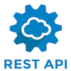

# HW10 Employee Management System - Project

## Project Description

This project will enable a manager keep and efficiently access records of their employees digitally. This project will be developed using Git, NodeJS, NPM Modules, RESTFul API, MySQL, HTML5 & CSS3.

---

## Table of Content

1. [Project Description](https://github.com/Brondchux/hw10-employee-management-system#project-description)
2. [Author Info](https://github.com/Brondchux/hw10-employee-management-system#author-info)
3. [User Story](https://github.com/Brondchux/hw10-employee-management-system#user-story)
4. [Minimum Requirements](https://github.com/Brondchux/hw10-employee-management-system#minimum-requirements)
5. [Mock-Up Preview](https://github.com/Brondchux/hw10-employee-management-system#mock-up-preview)
6. [Useful Links](https://github.com/Brondchux/hw10-employee-management-system#useful-links)
7. [Tech Stack](https://github.com/Brondchux/hw10-employee-management-system#tech-stack)
8. [Credits](https://github.com/Brondchux/hw10-employee-management-system#credits)
9. [License](https://github.com/Brondchux/hw10-employee-management-system#license)

---

## Author Info

Name: Gospel Chukwu

Email: hello@gospelchukwu.com

Portfolio: [www.gospelchukwu.com](https://brondchux.github.io/hw2-my-portfolio/)

---

## User Story

```
As a business owner
I want to be able to view and manage the departments, roles, and employees in my company
So that I can organize and plan my business
```

---

## Minimum Requirements

- Functional application.

- GitHub repository with a unique name and a README describing the project.

- The command-line application should allow users to:

  - Add departments, roles, employees

  - View departments, roles, employees

  - Update employee roles

---

## Mock-Up Preview

The completed application should look similar in appearance to the image below:


---

## Useful Links

1. 🗂 [Click me to view github repository for this project](https://github.com/Brondchux/hw10-employee-management-system/)
2. 🌍 [Click me to view deployed application via heroku](https://live-hw10-employee-management.herokuapp.com/)
3. 📺 [Click me to watch functionality video via screencastify](https://drive.google.com/file/d/12yWMt4ei-KCtK0mfkCYM8JstcutAeCpB/view)

---

## Tech Stack





---

## Credits

Appreciations to Ben 🙌🏾 of [Columbia University, Software Engineering Coding Boot Camp](https://bootcamp.cvn.columbia.edu/coding/landing-ftpt/?s=Google-Brand&msg_cv_scta=4&msg_cv_stbn=1&msg_cv_fcta=1&dki=Learn%20Coding&pkw=%2Bcolumbia%20%2Bcoding%20%2Bbootcamp&pcrid=471112563836&pmt=b&utm_source=google&utm_medium=cpc&utm_campaign=GGL%7CCOLUMBIA-UNIVERSITY%7CSEM%7CCODING%7C-%7COFL%7CTIER-1%7CALL%7CBRD%7CBMM%7CCore%7CBootcamp&utm_term=%2Bcolumbia%20%2Bcoding%20%2Bbootcamp&s=google&k=%2Bcolumbia%20%2Bcoding%20%2Bbootcamp&utm_adgroupid=111600049635&utm_locationphysicalms=9067609&utm_matchtype=b&utm_network=g&utm_device=c&utm_content=471112563836&utm_placement=&gclid=CjwKCAjwlrqHBhByEiwAnLmYUA8CIItksRJF6IT6XMX8WOOJBO-jtCRkzXZhI2gvsZrFEpYdRXy54RoC6jQQAvD_BwE&gclsrc=aw.ds) for being our tutor in this bootcamp.

Special thanks to [Google](https://www.google.com) for helping me find the accurate answers to my questions in a very timely manner.

---

## License

[](https://opensource.org/licenses/MIT)
